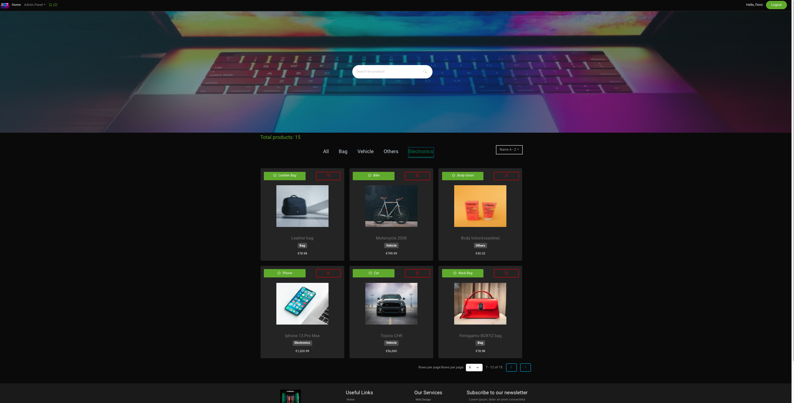
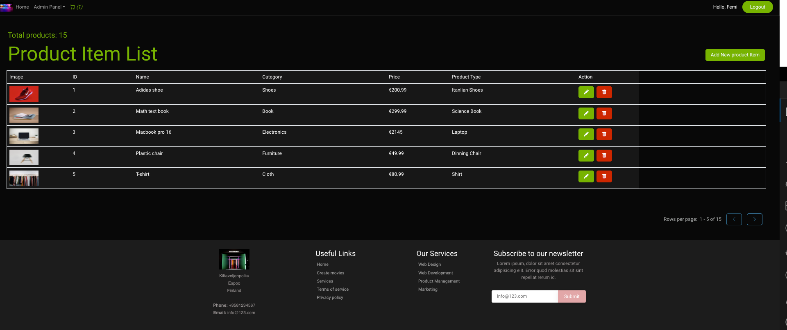

# Shopping Project

## Table of content

- [Introduction](#introduction)
- [Technologies](#technologies)
- [Installation](#installation)
- [Getting started](#getting-started)

## Introduction

This is the full-stack project built with ASP .NET core for the backend and React Redux RTK for the Frontend. For getting the full-stack project overview, eCommerce is used as an example to illustrate the connection.
This project aims to understand the connection between the backend, database structure, and the frontend.
In addition, the backend was modeled first by designing the model from top to bottom and vice versa with ERD (Entity Relation Diagram) to get the relation needed, such as one-one, one-many, and many-many.

## Technologies
- Backend
    + PostgreSQL
    + ASP .NET Core, 
    + Entity Framework Core
    + Stripe
- Frontend
    + RectJS
    + Bootsrap (for design and styling)
    + TypeScript
    + Redux
    + react-router-dom
    + Redux RTK Query
    + jwt-decode
    + bootswatch.com
    + React Stripe

## Installation
- Steps to perform the installation for the `Backend`
    + Register the database server with PostgreSQL
    + Check your local machine for .NET Core compatibility from microsoft webiste
    + Create an `appsettings.json` file in to main root like [example.json](/FullStack/Backend/example.json) file
    + Perform these following commands
        1. dotnet restore
        2. dotnet build
        3. dotnet run
    + For database migration
        1. dotnet ef migrations  add [added new name here]
        2. dotnet ef database update
- Steps to perform the installation for the `Frontend`
    + Install all the dependencies
        1. Write `npm install` on your terminal 
    + Runs the app in the development mode.
        1.  Write `npm start` on your terminal 

## Getting started
- Users have to generate a token and insert it before they could be able to get total access to all the functionality at backend.

### Frontend (UI) page

### Product page by admin user

+ Only admin can update or delete the product

### Order list page by admin user

+ Only admin can view this page 

### Order Summary page by admin user

+ Only admin can view this page, by following the processing 

+ For customer order's summary page 

### Backend page

